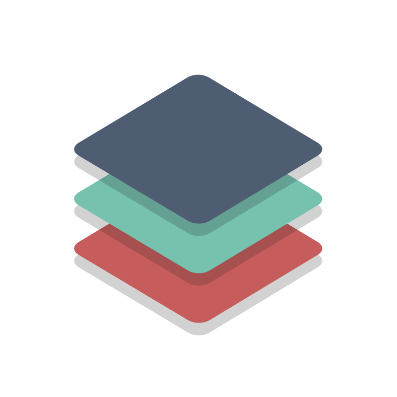

#  Clean Stack

 

# Clean Stack

## **Introduction**

Clean Stack is a comprehensive software development framework designed to streamline the creation of scalable, production-ready applications using modern technologies. In an ever-evolving tech landscape, developers often face challenges related to boilerplate code, inconsistent architectural patterns, and poor developer experience. Clean Stack addresses these challenges by providing a flexible yet structured foundation that emphasizes **clean code**, **efficiency**, and **scalability**.

### Philosophy

The Clean Stack philosophy is centered around the idea of "minimizing complexity while maximizing clarity." It encourages developers to focus on the business logic rather than boilerplate code. By embracing microservices architecture and promoting a modular approach, developers can create maintainable, testable, and easily extensible applications.

## **Target Audience**

The Clean Stack is ideal for:

- **Developers**: Those looking for a robust, easy-to-understand framework to kickstart their projects.
- **Startups**: Teams wanting to establish a scalable architecture without the burden of repetitive setup.
- **Industries**: Suitable for any tech-driven field, including:
  - E-commerce
  - FinTech
  - HealthTech
  - SaaS applications

## **Features**

| Feature | Description |
| --- | --- |
| **Monorepo Structure** | Organizes multiple related applications and libraries in a single repository for better management and code sharing. |
| **TypeScript Everywhere** | Utilizes TypeScript to enhance code quality and reduce runtime errors, providing type safety across the stack. |
| **Inter-Service Communication** | Implements gRPC for synchronous communication and integrates RabbitMQ or Kafka for asynchronous messaging, ensuring efficient data transfer. |
| **Built-in Observability** | Includes OpenTelemetry for monitoring and tracing, helping teams maintain insights into application performance and behavior. |
| **Caching and Rate Limiting** | Integrates caching solutions to optimize performance and rate limiting to protect services from abuse. |
| **Automated Testing** | Utilizes Vitest for fast and reliable testing, encouraging a test-driven development approach. |
| **Comprehensive Documentation** | Leveraging Docusaurus to document the architecture, features, and best practices, ensuring a smooth onboarding process for new developers. |

## **Benefits**

- **Increased Productivity**: Reduces the time spent on setup and boilerplate code, allowing developers to focus on delivering value.
- **Consistent Architecture**: Encourages adherence to clean code principles and established patterns, promoting maintainability.
- **Scalability**: Built with microservices in mind, ensuring that applications can grow and adapt to changing requirements.
- **Enhanced Collaboration**: With a well-documented structure, teams can collaborate more effectively, reducing onboarding time and improving knowledge sharing.

## **Technical Details**

| Technology              | Description                                                     |
| ----------------------- | --------------------------------------------------------------- |
| **Language(s)**         | TypeScript                                                      |
| **Framework(s)**        | NX Monorepo, Koa.js                                             |
| **Tools and Libraries** | gRPC, RabbitMQ/Kafka, OpenTelemetry, Vitest, Docusaurus, Docker |

## Contributing

We welcome contributions to Clean Stack! Please read our [Contributing Guidelines](CONTRIBUTING.md) for more information on how to get involved.

## License

This project is licensed under the MIT License - see the [LICENSE](LICENSE) file for details.

## Additional Resources

- [Documentation](https://clean-stack.sanyamarya.com/)
- [Community Forum](https://your-community-link)
- [Tutorials](https://your-tutorials-link)

For any questions or feedback, please contact us at [er.sanyam.arya@gmail.com](mailto:er.sanyam.arya@gmail.com).
