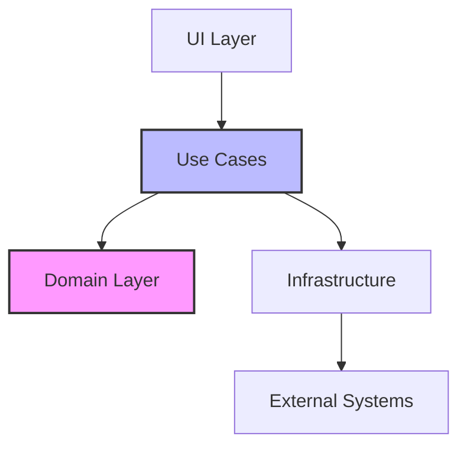
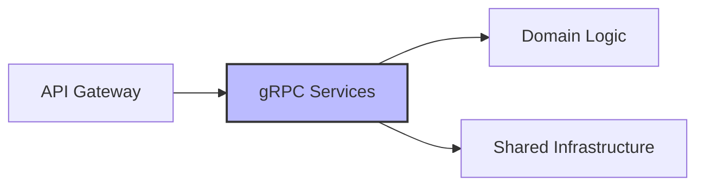

# Architecture Philosophy

## Vision

Clean Stack emerges from real-world challenges in modern software development. Our vision is to provide a robust foundation that eliminates common technical hurdles while maintaining flexibility for diverse business needs.

## Core Principles

### 1. Developer Experience First
- **Productivity Focus**: Tools and patterns chosen to maximize developer efficiency
- **Type Safety**: End-to-end TypeScript for better code reliability
- **Clear Conventions**: Standardized practices to reduce decision fatigue
- **Great Documentation**: Comprehensive guides and API documentation

### 2. Domain-Driven Design
- **Clear Boundaries**: Business logic isolated in domain layer
- **Pure Core**: Domain logic free from technical concerns
- **Shared Understanding**: Common language between technical and business teams
- **Flexible Evolution**: Easy adaptation to changing business needs

### 3. Clean Architecture

- **Independent Core**: Business logic independent of frameworks
- **Dependency Inversion**: External concerns depend on core, not vice versa
- **Clear Interfaces**: Well-defined boundaries between layers
- **Testable Design**: Easy to test each layer in isolation

### 4. Microservices Done Right

- **Smart Endpoints**: Services contain business logic
- **Dumb Pipes**: Simple, reliable communication via gRPC
- **Independent Deployment**: Services can be deployed independently
- **Resilient Design**: Fault isolation and graceful degradation

### 5. Observable by Default
- **Distributed Tracing**: Track requests across services
- **Metrics Collection**: Monitor system health and performance
- **Structured Logging**: Consistent logging across services
- **Performance Insights**: Built-in tools for performance analysis

### 6. Production Ready
- **Security First**: Built-in security best practices
- **Scalable Architecture**: Designed for horizontal scaling
- **Performance Optimized**: Efficient resource usage
- **Maintainable Code**: Clear structure and conventions

## Implementation Philosophy

### Technology Choices
Each technology is chosen with clear purpose:

| Choice           | Rationale                                        |
|-----------------|--------------------------------------------------|
| Bun             | Modern, fast, compatible package management      |
| Koa             | Lightweight, modern HTTP server framework        |
| gRPC            | Efficient, type-safe service communication      |
| OpenTelemetry   | Industry standard observability                 |
| NX              | Powerful monorepo management                    |

### Error Handling
- **Custom Error Types**: Domain-specific error handling
- **Consistent Patterns**: Standard error handling across services
- **Clear Communication**: User-friendly error messages
- **Proper Logging**: Error tracking and debugging support

### Testing Strategy
- **Unit Testing**: Core business logic
- **Integration Testing**: Service interactions
- **E2E Testing**: Critical user paths
- **Performance Testing**: Load and stress tests

## Evolution and Maintenance

### Continuous Improvement
- Regular dependency updates
- Performance monitoring and optimization
- Security audits and updates
- Community feedback integration

### Future Focus Areas
1. **AI Integration**: Tools for AI-driven applications
2. **Edge Computing**: Support for edge deployment
3. **Developer Tooling**: Enhanced development experience
4. **Security Features**: Advanced security capabilities

This philosophy guide serves as our north star, ensuring all development aligns with our core principles and vision.
