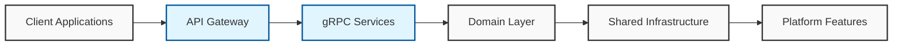
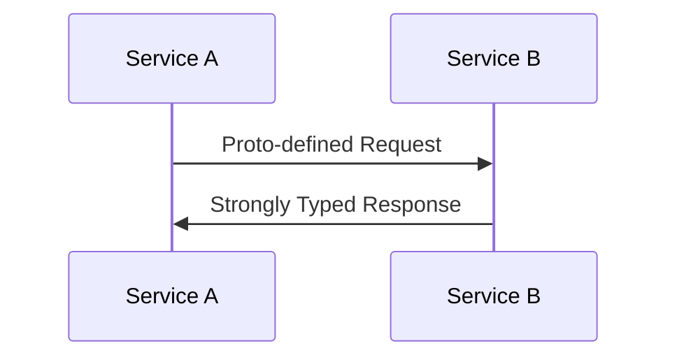

# Philosophy of Clean Stack

Clean Stack emerges from real-world challenges in modern software development. It's designed to eliminate repetitive tasks while maintaining high standards for production-grade applications.

## Core Principles

1. **Developer Experience First** - Every tool and pattern chosen prioritizes developer productivity
2. **Convention over Configuration** - Standardized practices reduce decision fatigue
3. **Scalability by Default** - Architecture decisions that support growth from day one
4. **Observable Systems** - Built-in telemetry and monitoring capabilities
5. **Type Safety Throughout** - End-to-end TypeScript implementation

## Architecture Overview

## Monorepo Structure Explained

The monorepo approach using NX offers several key advantages:

| Aspect                | Benefit                                                |
| --------------------- | ------------------------------------------------------ |
| Code Sharing          | Seamless sharing of types, utilities, and domain logic |
| Dependency Management | Centralized versioning and updates                     |
| Build Optimization    | Intelligent caching and selective rebuilds             |
| Testing               | Unified test coverage and integration testing          |

Our directory structure follows a domain-driven design:

- **apps**: User-facing applications and documentation
- **domain**: Core business logic and shared types
- **framework**: Reusable technical components
- **platform-features**: Cross-cutting concerns
- **services**: Microservice implementations
- **tools**: Development and deployment utilities

## Technology Choices

### Bun as Package Manager

Bun brings significant improvements to the development workflow:

- **Performance**: Up to 30x faster than npm
- **Built-in Tools**: Testing, bundling, and TypeScript support
- **Compatibility**: Drop-in replacement for node
- **Resource Efficiency**: Lower memory footprint

### Koa Over Express

Koa represents a modern approach to middleware:

- **Async/Await**: Native support for modern JavaScript patterns
- **Middleware Composition**: Cleaner error handling through async functions
- **Lightweight Core**: Minimal base with powerful extensibility
- **Modern Architecture**: Built for current JavaScript ecosystem

### gRPC for Service Communication

gRPC provides:

| Feature         | Impact                                           |
| --------------- | ------------------------------------------------ |
| Performance     | Binary protocol with high throughput             |
| Type Safety     | Contract-first development with protocol buffers |
| Bi-directional  | Streaming capabilities for real-time features    |
| Code Generation | Automatic client/server code generation          |

## Infrastructure Components

### Observability Stack

Built on OpenTelemetry:

- Distributed tracing
- Metrics collection
- Log correlation
- Performance monitoring

### Caching Strategy

Multi-level caching implementation:

- In-memory caching for hot data
- Distributed caching with Redis
- Cache invalidation patterns

### Rate Limiting

Intelligent rate limiting:

- Service-level protection
- User-based quotas
- Distributed rate limiting

## Development Workflow

### Testing Philosophy

- Unit tests with Vitest
- Integration tests across services
- End-to-end testing
- Performance benchmarking

## Best Practices

1. **Service Boundaries**: Clear separation based on business domains
2. **Error Handling**: Standardized error types and handling
3. **Documentation**: Automated API documentation
4. **Code Style**: Consistent formatting and linting
5. **Security**: Built-in security practices

## Scalability Considerations

- Horizontal scaling of services
- Message queue integration
- Database sharding strategies
- Caching optimization

## Maintenance and Evolution

- Regular dependency updates
- Performance monitoring
- Security audits
- Feature deprecation strategy

This philosophy document serves as a living guide, evolving with the project and community feedback. It represents our commitment to building maintainable, scalable, and developer-friendly systems.
