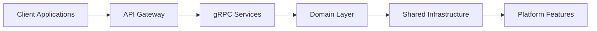

# Introduction to Clean Stack

Clean Stack is a comprehensive, production-ready TypeScript development stack built for modern microservices architecture. It combines battle-tested tools and patterns with developer-friendly conventions to help you build scalable applications faster. 🚀

## What is Clean Stack?

Clean Stack is more than just a boilerplate - it's a complete development ecosystem that provides:

- **Type-safe Development** - End-to-end TypeScript implementation
- **Microservices Architecture** - Built-in gRPC communication
- **Developer Experience** - Streamlined workflows and tooling
- **Production Ready** - Built-in observability, caching, and rate limiting
- **Scalable by Design** - Cloud-native architecture patterns

## Key Features

| Feature       | Description                                       |
| ------------- | ------------------------------------------------- |
| NX Monorepo   | Unified codebase management with powerful tooling |
| gRPC Services | High-performance, type-safe service communication |
| OpenTelemetry | Built-in observability and monitoring             |
| Caching       | Multi-level caching with Redis integration        |
| Rate Limiting | Distributed rate limiting out of the box          |
| Koa Framework | Modern, middleware-based HTTP server              |

## Quick Example

Here's a glimpse of how Clean Stack simplifies service creation:

```typescript
import { createKoaServer } from '@clean-stack/koa-server-essentials';
import { initTelemetry } from '@clean-stack/backend-telemetry';
import { createCache } from '@clean-stack/cache';

// Initialize core features
await initTelemetry('user-service');
const cache = await createCache();

// Create server with middleware
const server = await createKoaServer({
  name: 'user-service',
  port: 3000,
  cache,
  // Additional features configured automatically
});

server.start();
```

## Why Clean Stack?

Clean Stack addresses common challenges in modern application development:

- **Boilerplate Reduction** - Stop writing the same setup code repeatedly
- **Consistent Architecture** - Follow established patterns across services
- **Production Readiness** - Essential features built-in and ready to use
- **Developer Productivity** - Focus on business logic, not infrastructure
- **Maintainability** - Clear structure and conventions

## Core Principles

1. **Convention over Configuration**
   - Sensible defaults
   - Minimal setup required
   - Flexible when needed

2. **Developer Experience First**
   - Comprehensive documentation
   - Type safety throughout
   - Intuitive APIs

3. **Production Ready**
   - Built-in observability
   - Error handling
   - Performance optimized

## Getting Started

Ready to build your first Clean Stack application? 

```bash
# Create a new Clean Stack project
bun create clean-stack-app my-app

# Start the development environment
cd my-app
bun run platform:all
bun run dev
```

Check out our [Quick Start Guide](./getting-started/quick-start) to begin your journey with Clean Stack.

## Architecture Overview



## Next Steps

- [Quick Start Guide](./getting-started/quick-start)
- [Project Structure](./getting-started/project-structure)
- [Core Concepts](./architecture/philosophy)
- [Platform Features](./platform-features/overview)

## Community and Support

- [GitHub Repository](https://github.com/your-org/clean-stack)
- [Discord Community](https://discord.gg/your-community)
- [Stack Overflow](https://stackoverflow.com/questions/tagged/clean-stack)

## Contributing

We welcome contributions! Whether it's:
- Reporting bugs
- Improving documentation
- Submitting feature requests
- Contributing code

Check our [Contributing Guide](./contributing) to get started.
