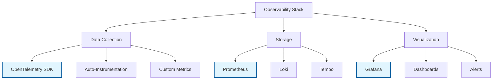

# Observability in Clean Stack

Clean Stack provides comprehensive observability through OpenTelemetry integration, giving you complete visibility into your applications.

## Quick Links
- [Understanding OpenTelemetry](./what-is-otel)
- [Observability Stack Setup](./otel-clean-stack)
- [Backend Telemetry Integration](./backend-telemetry)

## Observability Components



## Features at a Glance

### 1. Metrics
- Application performance metrics
- Resource utilization tracking
- Custom business metrics
- Pre-configured Grafana dashboards

### 2. Logging
- Structured logging with Pino
- Log aggregation in Loki
- Correlation with traces
- Log-based alerts

### 3. Tracing
- Distributed tracing with Tempo
- Request flow visualization
- Performance bottleneck detection
- Error tracking

### 4. Visualization
- Unified Grafana interface
- Pre-built dashboards
- Custom visualization options
- Alert configuration

## Getting Started

1. Start the observability stack:
   ```bash
   cd PLATFORM_SETUP/observability_stack
   docker-compose up -d
   ```

2. Access the interfaces:
   - Grafana: http://localhost:3000
   - Prometheus: http://localhost:9090
   - Tempo: http://localhost:3200

## Next Steps

1. [Learn about OpenTelemetry](./what-is-otel)
2. [Set up the observability stack](./otel-clean-stack)
3. [Implement backend telemetry](./backend-telemetry)
