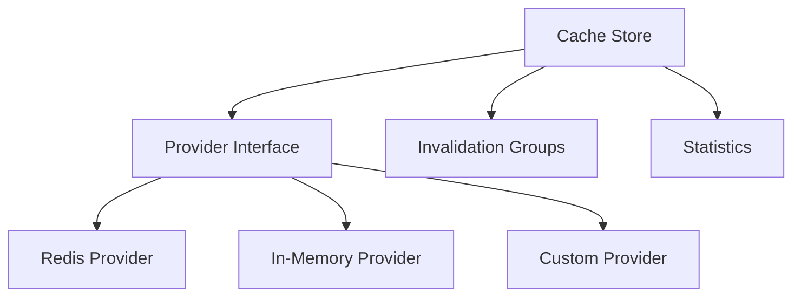

# Cache Implementation Guide

## Overview

Clean Stack provides a flexible caching system through the `@clean-stack/cache` package. The implementation supports multiple cache providers with a consistent interface.

## Core Components



## Installation

```bash
bun install @clean-stack/cache
```

## Basic Usage

```typescript
import { createCacheStore } from '@clean-stack/cache';
import { createRedisProvider } from '@clean-stack/redis';

// Initialize provider
const redisProvider = await createRedisProvider({
  url: 'redis://localhost:6379',
});

// Create cache store
const cacheStore = await createCacheStore(redisProvider);

// Basic operations
await cacheStore.set('key', 'value', { ttl: 3600 });
const value = await cacheStore.get('key');
await cacheStore.delete('key');
```

## Cache Provider Interface

```typescript
interface CacheProvider {
  set(key: string, value: string, ttl?: number): Promise<void>;
  get(key: string): Promise<string | null>;
  delete(key: string): Promise<void>;
  deleteManyKeys(keys: string[]): Promise<void>;
  clear(): Promise<void>;
  getAllKeys(): Promise<string[]>;
}
```

## Invalidation Groups

Groups allow efficient invalidation of related cache entries:

```typescript
// Store with groups
await cacheStore.set('user:1', userData, {
  groups: ['users', 'active-users'],
});

await cacheStore.set('user:2', userData2, {
  groups: ['users', 'inactive-users'],
});

// Invalidate by group
await cacheStore.invalidateGroup('active-users'); // Removes user:1
await cacheStore.invalidateGroup('users'); // Removes both
```

## Middleware Usage

Integrate with Koa middleware for automatic caching:

```typescript
import { createCacheMiddleware } from '@clean-stack/cache';

const cacheMiddleware = createCacheMiddleware(cacheStore, {
  defaultTTL: 3600,
  keyPrefix: 'api:',
});

router.get(
  '/users/:id',
  cacheMiddleware(), // Cache with default options
  async ctx => {
    // Handler logic
  }
);

router.get(
  '/products',
  cacheMiddleware({
    ttl: 1800,
    keyGenerator: ctx => `products:${ctx.query.category}`,
    groups: ['products'],
  }),
  async ctx => {
    // Handler logic
  }
);
```

## Performance Considerations

1. **Key Design**

   - Use consistent naming patterns
   - Include version in keys if data format changes
   - Keep keys reasonably short

2. **TTL Strategy**

   - Set appropriate TTLs based on data volatility
   - Use shorter TTLs for frequently changing data
   - Consider using infinite TTL for static data

3. **Group Management**
   - Group related items logically
   - Don't overuse groups - they add overhead
   - Consider data relationships when designing groups

## Monitoring & Statistics

The cache store tracks important metrics:

```typescript
const stats = await cacheStore.getStatistics();
console.log(stats);
// {
//   hits: 150,
//   misses: 45,
//   hitRate: 0.769,
//   size: 195,
//   groupCount: 5
// }
```

## Error Handling

The cache store includes built-in error handling:

```typescript
try {
  await cacheStore.set('key', 'value');
} catch (error) {
  if (error instanceof CacheProviderError) {
    // Handle provider-specific errors
  } else if (error instanceof CacheKeyError) {
    // Handle key validation errors
  }
}
```

## Best Practices

1. **Data Serialization**

   ```typescript
   // Do serialize complex data
   await cache.set('user', JSON.stringify(user));
   const user = JSON.parse(await cache.get('user'));
   ```

2. **Error Handling**

   ```typescript
   // Handle cache failures gracefully
   const getUserData = async (id: string) => {
     try {
       const cached = await cache.get(`user:${id}`);
       if (cached) return JSON.parse(cached);
     } catch (error) {
       logger.warn('Cache error', error);
     }
     return fetchUserFromDB(id);
   };
   ```

3. **Group Management**
   ```typescript
   // Group related data
   await cache.set(`user:${id}`, userData, {
     groups: ['users', `user:${id}:*`],
   });
   await cache.set(`user:${id}:preferences`, prefs, {
     groups: [`user:${id}:*`],
   });
   ```

## Common Patterns

### Cache-Aside Pattern

```typescript
async function getUser(id: string) {
  const cacheKey = `user:${id}`;

  // Try cache first
  const cached = await cacheStore.get(cacheKey);
  if (cached) return JSON.parse(cached);

  // Cache miss - get from database
  const user = await database.users.findById(id);

  // Store in cache
  await cacheStore.set(cacheKey, JSON.stringify(user), {
    ttl: 3600,
    groups: ['users'],
  });

  return user;
}
```

### Bulk Operations

```typescript
async function bulkGetUsers(ids: string[]) {
  const cacheKeys = ids.map(id => `user:${id}`);

  // Get all cached users
  const cachedUsers = await Promise.all(cacheKeys.map(key => cacheStore.get(key)));

  // Find missing users
  const missingIds = ids.filter((_, i) => !cachedUsers[i]);

  if (missingIds.length > 0) {
    const dbUsers = await database.users.findByIds(missingIds);

    // Cache missing users
    await Promise.all(
      dbUsers.map(user =>
        cacheStore.set(`user:${user.id}`, JSON.stringify(user), {
          groups: ['users'],
        })
      )
    );

    // Merge results
    return ids.map((id, i) => (cachedUsers[i] ? JSON.parse(cachedUsers[i]) : dbUsers.find(u => u.id === id)));
  }

  return cachedUsers.map(u => JSON.parse(u));
}
```
