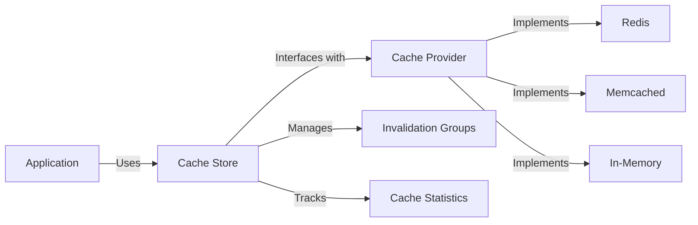
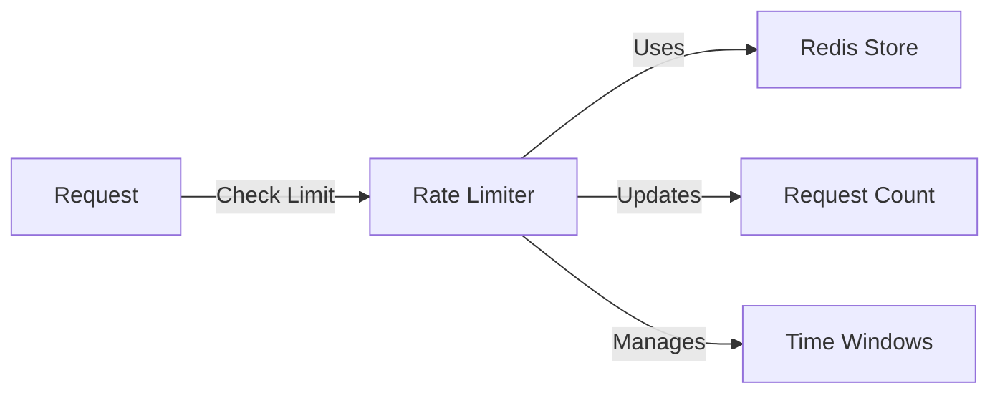

# Platform Features Implementation

## Cache Store Implementation

Located in `platform-features/cache`, the cache store provides a flexible caching solution:

### Core Features

- Provider-agnostic design
- Redis integration out of the box
- Group-based cache invalidation
- Built-in statistics tracking
- TTL support with key hashing

### Architecture



### Usage Example

```typescript
import { createCacheStore } from '@clean-stack/platform-features/cache';
import { gerRedisCacheProvider } from '@clean-stack/platform-features/cache';

// Initialize Redis provider
const redisProvider = gerRedisCacheProvider(redisClient);
const cacheStore = createCacheStore(redisProvider);

// Cache with groups
await cacheStore.addOrReplace('user:1', userData, {
  ttl: 3600,
  groups: ['users', 'active-users'],
});

// Invalidate group
await cacheStore.invalidateGroup('users');
```

## Rate Limiter Implementation

Located in `platform-features/rate-limiter`, the rate limiter provides traffic control:

### Core Features

- Flexible rate limiting windows
- Redis-based distributed limiting
- Customizable limits per endpoint/user
- Built-in request tracking
- Hash-based key management

### Architecture



### Usage Example

```typescript
import { createRateLimiter } from '@clean-stack/rate-limiter';

const rateLimiter = createRateLimiter(redisProvider, {
  maxRequests: 100,
  duration: 3600, // 1 hour window
});

// Check rate limit
const isAllowed = await rateLimiter.isAllowedRateLimit('user:123');
if (!isAllowed) {
  throw new Error('Rate limit exceeded');
}
```

## Error Handling Implementation

Located in `domain/custom-errors`, provides standardized error handling:

### Core Features

- Base AppError with metadata support
- Request validation errors
- i18n error messages
- HTTP status mapping
- Centralized error handler

### Usage Example

```typescript
import { AppError } from '@clean-stack/custom-errors';

throw new AppError('RESOURCE_NOT_FOUND', {
  context: { userId: 123 },
  metadata: { resource: 'user' },
});
```

## Common Implementation Patterns

All platform features follow these principles:

1. **Provider Abstraction**

   - Clean interfaces for providers
   - Easy to swap implementations
   - Testable design

2. **Type Safety**

   - Full TypeScript support
   - Zod validation where needed
   - Strong typing for configurations

3. **Performance**

   - Efficient data structures
   - Proper resource cleanup
   - Optimized algorithms

4. **Monitoring**
   - Built-in statistics
   - Telemetry integration
   - Error tracking
