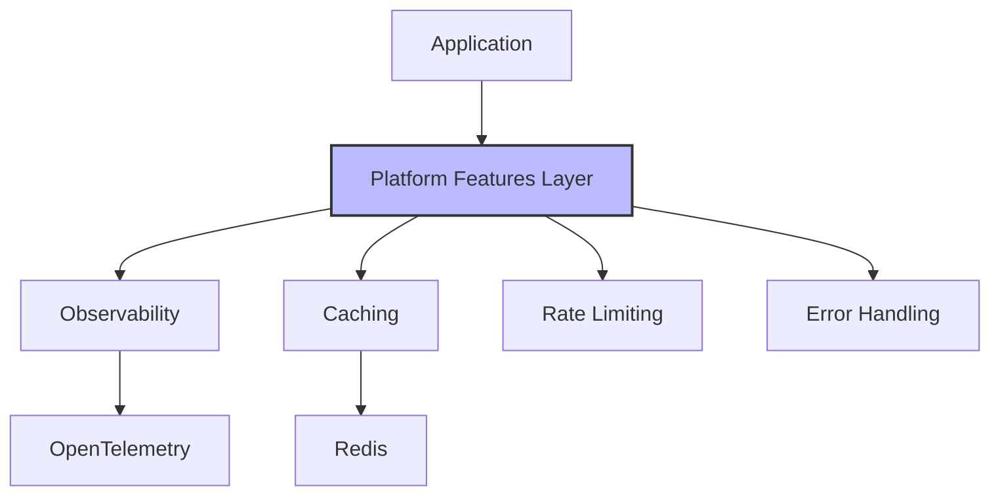

# Platform Features Overview

Clean Stack comes with a set of powerful platform features designed to help you build robust, scalable applications.

## Core Features

### 1. Observability

Observability is at the heart of Clean Stack, providing deep insights into your application's behavior and performance.

#### Key Pillars

1. **Logs**: Timestamped records of discrete events
   - Structured logging
   - Centralized log aggregation
   - Log correlation with traces

2. **Metrics**: Quantitative measurements
   - System metrics (CPU, Memory, etc.)
   - Business metrics
   - Custom metrics support

3. **Traces**: Request flow visualization
   - End-to-end request tracking
   - Service dependency mapping
   - Performance bottleneck identification

#### Benefits
- Proactive issue detection
- Faster troubleshooting
- Performance optimization
- Data-driven decisions

### 2. Caching

Multi-level caching system with:
- Redis integration
- Cache invalidation groups
- Automatic cache management
- Performance monitoring

### 3. Rate Limiting

Distributed rate limiting for:
- API protection
- Resource optimization
- Fair usage enforcement
- DDoS prevention

### 4. Error Handling

Comprehensive error management with:
- Custom error types
- Consistent error patterns
- Error tracking
- User-friendly messages

## Integration Architecture



## Getting Started

Each feature is designed to work seamlessly with minimal configuration while allowing deep customization when needed:

1. **Default Configuration**
   ```typescript
   import { initTelemetry } from '@clean-stack/backend-telemetry';
   await initTelemetry('my-service');
   ```

2. **Custom Setup**
   ```typescript
   import { createCache } from '@clean-stack/cache';
   const cache = await createCache({
     provider: 'redis',
     ttl: 3600,
     prefix: 'my-app:'
   });
   ```

## Best Practices

1. **Start with Defaults**: Use provided defaults for quick setup
2. **Monitor First**: Implement observability before other features
3. **Cache Strategically**: Identify and cache frequently accessed data
4. **Rate Limit APIs**: Protect public endpoints with rate limiting
5. **Handle Errors**: Use custom error types for better debugging

## Next Steps

- [Observability Guide](./observability/otel-clean-stack)
- [Caching Implementation](./caching)
- [Rate Limiting Setup](./rate-limiter)
