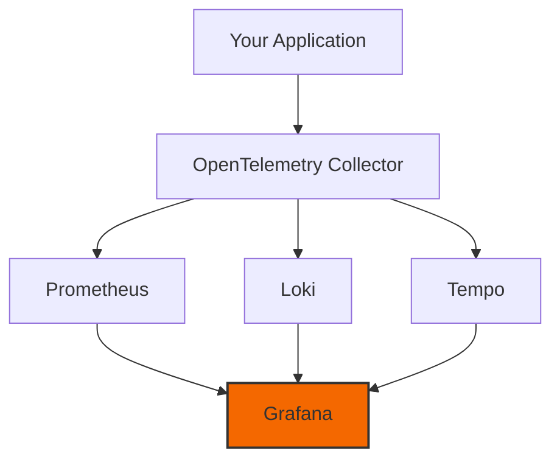

# Grafana Stack Integration

Clean Stack integrates with the Grafana observability stack (Grafana, Prometheus, Loki, and Tempo) to provide a complete observability solution.

## Stack Overview



## Quick Start

1. Start the observability stack:

```bash
bun run platform:observability
```

2. Access Grafana:

- URL: http://localhost:3000
- Default credentials:
  - Username: admin
  - Password: admin

## Pre-configured Dashboards

### 1. Service Overview

- Request rates and latencies
- Error rates
- Resource usage
- Cache performance

### 2. Distributed Tracing

- End-to-end request flows
- Service dependencies
- Performance bottlenecks
- Error analysis

### 3. Log Analytics

- Structured log search
- Log correlation
- Pattern analysis
- Alert configuration

## Custom Dashboard Creation

### 1. Metrics Dashboard

```typescript
// Define custom metrics
const requestDuration = metrics.createHistogram('http_request_duration', {
  description: 'HTTP request duration',
  unit: 'ms',
  boundaries: [10, 50, 100, 200, 500, 1000],
});

// Use in your code
app.use(async (ctx, next) => {
  const startTime = Date.now();
  try {
    await next();
  } finally {
    const duration = Date.now() - startTime;
    requestDuration.record(duration, {
      path: ctx.path,
      method: ctx.method,
      status: ctx.status,
    });
  }
});
```

Then in Grafana:

1. Add new panel
2. Query: `rate(http_request_duration_bucket[5m])`
3. Visualization: Heatmap

### 2. Trace Analysis

```typescript
// Add custom attributes to spans
const span = tracer.startSpan('process-order');
span.setAttribute('order.id', orderId);
span.setAttribute('customer.type', customerType);
span.setAttribute('order.value', orderValue);
```

In Grafana Tempo:

1. Search by attribute
2. Create Service Graph
3. Analyze Flame Graph

### 3. Log Queries

```typescript
// Structured logging
logger.info('Order processed', {
  orderId: 'order-123',
  processingTime: 150,
  customerTier: 'premium',
});
```

In Grafana Loki:

```logql
{service="order-service"}
  | json
  | processingTime > 100
  | customerTier="premium"
```

## Alert Configuration

### 1. High Latency Alert

```yaml
# In Grafana UI:
alert:
  name: High Service Latency
  condition: avg_over_time(http_request_duration_seconds[5m]) > 0.5
  for: 5m
  labels:
    severity: warning
  annotations:
    summary: Service experiencing high latency
```

### 2. Error Rate Alert

```yaml
alert:
  name: High Error Rate
  condition: |
    sum(rate(http_requests_total{status=~"5.."}[5m])) 
    / 
    sum(rate(http_requests_total[5m])) > 0.05
  for: 5m
  labels:
    severity: critical
```

## Data Retention

Default retention periods:

- Metrics (Prometheus): 15 days
- Logs (Loki): 7 days
- Traces (Tempo): 3 days

Configure in docker-compose:

```yaml
prometheus:
  command:
    - '--storage.tsdb.retention.time=30d'

loki:
  config:
    table_manager:
      retention_period: 168h

tempo:
  retention_period: 72h
```

## Best Practices

1. **Dashboard Organization**

   - Use folders for different teams/services
   - Standardize naming conventions
   - Include documentation panels

2. **Query Optimization**

   - Use recording rules for complex queries
   - Limit high-cardinality labels
   - Set appropriate time ranges

3. **Alert Management**
   - Define clear severity levels
   - Include runbooks in alerts
   - Configure proper notification channels

## Troubleshooting

### Common Issues

1. **Missing Data**

   - Check collector connectivity
   - Verify port configurations
   - Ensure correct label matching

2. **Dashboard Performance**

   - Optimize time ranges
   - Use appropriate refresh intervals
   - Minimize panel count

3. **Alert Issues**
   - Validate alert conditions
   - Check notification settings
   - Review alert history

## Security Considerations

1. **Access Control**

   ```yaml
   grafana:
     env:
       GF_AUTH_DISABLE_LOGIN_FORM: 'false'
       GF_AUTH_ANONYMOUS_ENABLED: 'false'
   ```

2. **Network Security**

   - Use TLS for data transmission
   - Implement proper authentication
   - Restrict network access

3. **Data Protection**
   - Configure data retention
   - Implement log sanitization
   - Manage sensitive labels
