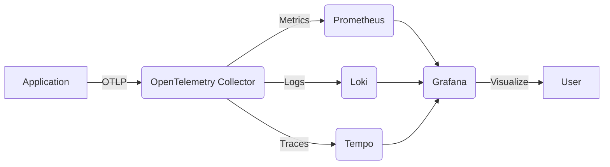

# Observability Stack in Clean Stack

### [Docker Compose Setup](https://github.com/ersanyamarya/clean-stack/blob/main/PLATFORM_SETUP/observability_stack/docker-compose.yml)

The OpenTelemetry stack in Clean Stack is set up using Docker Compose, which orchestrates multiple containers to create a comprehensive observability solution. The stack consists of the following components:

1. **OpenTelemetry Collector**: Receives, processes, and exports telemetry data.
2. **Prometheus**: Stores and queries metrics data.
3. **Grafana**: Visualizes metrics, logs, and traces.
4. **Loki**: Aggregates and queries log data.
5. **Tempo**: Stores and queries distributed traces.

Here's a high-level overview of the observability stack architecture:



### Configuration Files

The setup includes several configuration files:

1. **datasources.yml**: Configures Grafana data sources for Prometheus, Loki, and Tempo.
2. **grafana.ini**: Sets up anonymous access and disables the login form for Grafana.
3. **loki-config.yml**: Configures Loki for log aggregation and storage.
4. **otel-collector-config.yml**: Defines the OpenTelemetry Collector's behavior for receiving and exporting telemetry data.
5. **prometheus.yml**: Configures Prometheus to scrape metrics from the OpenTelemetry Collector.
6. **tempo-config.yml**: Sets up Tempo for distributed tracing storage and querying.

### Docker Compose File

The `docker-compose.yml` file defines the services, their configurations, and network settings:

- **otel-collector**: Uses the OpenTelemetry Collector Contrib image and exposes ports for OTLP receivers and Prometheus metrics.
- **prometheus**: Configured to scrape metrics from the OpenTelemetry Collector.
- **grafana**: Set up with pre-configured data sources and anonymous admin access.
- **loki**: Configured for log aggregation and storage.
- **tempo**: Set up for distributed tracing storage and querying.

All services are connected through a custom Docker network called `otel-network`.

### Key Features

1. **Centralized Data Collection**: The OpenTelemetry Collector acts as a central point for receiving all telemetry data.
2. **Data Separation**: Metrics, logs, and traces are stored in separate, specialized systems (Prometheus, Loki, and Tempo).
3. **Unified Visualization**: Grafana provides a single pane of glass for visualizing all observability data.
4. **Scalability**: Each component can be scaled independently as needed.
5. **Persistence**: Data volumes are mounted to ensure data persistence across container restarts.

### Usage

To use this observability stack:

1. Ensure Docker and Docker Compose are installed on your system.
2. Navigate to the `PLATFORM_SETUP/observability_stack/` directory.
3. Run `docker-compose up -d` to start all services.
4. Access Grafana at `http://localhost:3000` to view your observability data.

This setup provides a robust foundation for observability in Clean Stack, allowing you to collect, store, and visualize metrics, logs, and traces from your applications efficiently.

Certainly, Sanyam! I'll include some key configurations from the setup to give a more detailed understanding of how each component is configured. Here's an expanded explanation with config snippets:

### Key Configurations

Let's look at some important configurations for each component:

#### OpenTelemetry Collector (otel-collector-config.yml)

```yaml showLineNumbers
receivers:
  otlp:
    protocols:
      grpc:
        endpoint: 0.0.0.0:4317
      http:
        endpoint: 0.0.0.0:4318

exporters:
  prometheus:
    endpoint: '0.0.0.0:8889'
  loki:
    endpoint: 'http://loki:3100/loki/api/v1/push'
  otlp:
    endpoint: 'tempo:4317'
    tls:
      insecure: true

service:
  pipelines:
    traces:
      receivers: [otlp]
      processors: [batch]
      exporters: [otlp]
    metrics:
      receivers: [otlp]
      processors: [batch]
      exporters: [prometheus]
    logs:
      receivers: [otlp]
      processors: [batch]
      exporters: [loki]
```

This configuration sets up the OpenTelemetry Collector to:

- Receive data via OTLP (both gRPC and HTTP)
- Export metrics to Prometheus, logs to Loki, and traces to Tempo
- Use batch processing for efficiency

#### Prometheus (prometheus.yml)

```yaml showLineNumbers
global:
  scrape_interval: 15s
  evaluation_interval: 15s
scrape_configs:
  - job_name: 'otel-collector'
    static_configs:
      - targets: ['otel-collector:8889']
```

Prometheus is configured to scrape metrics from the OpenTelemetry Collector every 15 seconds.

#### Grafana (datasources.yml)

```yaml showLineNumbers
apiVersion: 1

datasources:
  - name: Prometheus
    type: prometheus
    access: proxy
    url: http://prometheus:9090

  - name: Loki
    type: loki
    access: proxy
    url: http://loki:3100

  - name: Tempo
    type: tempo
    access: proxy
    url: http://tempo:3200
```

This configuration sets up Grafana to connect to Prometheus, Loki, and Tempo, allowing you to visualize all your observability data in one place.

#### Loki (loki-config.yml)

```yaml showLineNumbers
auth_enabled: false

server:
  http_listen_port: 3100

schema_config:
  configs:
    - from: 2020-05-15
      store: boltdb
      object_store: filesystem
      schema: v11
      index:
        prefix: index_
        period: 168h

storage_config:
  boltdb:
    directory: /loki/index

  filesystem:
    directory: /loki/chunks
```

This configuration sets up Loki for log storage, using a local filesystem for both the index and log chunks.

#### Tempo (tempo-config.yml)

```yaml showLineNumbers
server:
  http_listen_port: 3200

distributor:
  receivers:
    otlp:
      protocols:
        grpc:

storage:
  trace:
    backend: local
    local:
      path: /tmp/tempo/blocks
```

Tempo is configured to receive traces via OTLP gRPC and store them locally.

### Docker Compose Networking

In the `docker-compose.yml` file, all services are connected through a custom network:

```yaml
networks:
  otel-network:
    driver: bridge
```

Each service is then configured to use this network:

```yaml
services:
  otel-collector:
    # ... other configurations ...
    networks:
      - otel-network

  # Similar network configuration for other services
```

This networking setup ensures that all components can communicate with each other using their service names as hostnames.

### Data Persistence

To ensure data persistence across container restarts, volumes are mounted for each service. For example:

```yaml
services:
  prometheus:
    # ... other configurations ...
    volumes:
      - ./config/prometheus.yml:/etc/prometheus/prometheus.yml
      - ./data/prometheus:/prometheus

  # Similar volume configurations for other services
```

These volume mounts ensure that configuration files and data are preserved even if containers are stopped or removed.

By understanding these configurations, you can customize the observability stack to fit your specific needs in Clean Stack. This setup provides a flexible and powerful foundation for monitoring and troubleshooting your applications.

### Troubleshooting

#### Issue: "Grafana is not accessible at http://localhost:3000"
**Cause**: Grafana service might not be running or is misconfigured.
**Solution**:
1. Check the status of the Grafana container:
   ```bash
   docker ps | grep grafana
   ```
2. Restart the Grafana service:
   ```bash
   docker-compose restart grafana
   ```
3. Verify the logs for errors:
   ```bash
   docker logs grafana
   ```

#### Issue: "No metrics visible in Grafana dashboards"
**Cause**: Prometheus might not be scraping metrics correctly.
**Solution**:
1. Verify Prometheus is running:
   ```bash
   docker ps | grep prometheus
   ```
2. Check the Prometheus configuration file (`prometheus.yml`) for correct scrape targets.
3. Access Prometheus at `http://localhost:9090` and verify the targets are up.

#### Issue: "Logs are not appearing in Loki"
**Cause**: Loki might not be receiving logs from the OpenTelemetry Collector.
**Solution**:
1. Check the Loki service status:
   ```bash
   docker ps | grep loki
   ```
2. Verify the OpenTelemetry Collector configuration (`otel-collector-config.yml`) for the Loki exporter settings.
3. Inspect Loki logs for errors:
   ```bash
   docker logs loki
   ```

#### Issue: "Traces are missing in Tempo"
**Cause**: Tempo might not be receiving traces from the OpenTelemetry Collector.
**Solution**:
1. Check the Tempo service status:
   ```bash
   docker ps | grep tempo
   ```
2. Verify the OpenTelemetry Collector configuration (`otel-collector-config.yml`) for the Tempo exporter settings.
3. Inspect Tempo logs for errors:
   ```bash
   docker logs tempo
   ```
