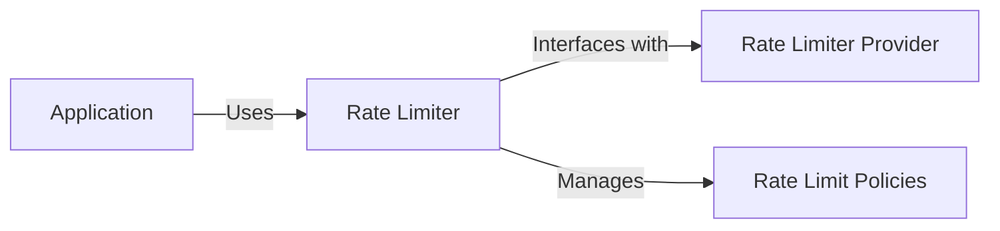

# Rate Limiter for Clean Stack

## What is Rate Limiting?

Rate limiting is a technique used to control the number of requests a user can make to a server within a specified time frame. It helps in managing server load, preventing abuse, and ensuring fair usage of resources.

## Why is Rate Limiting Necessary?

1. **Prevent Abuse**: Protects against denial-of-service attacks and other malicious activities.
2. **Resource Management**: Ensures fair distribution of resources among users.
3. **Performance Stability**: Maintains consistent performance by preventing server overload.
4. **Cost Control**: Reduces costs associated with excessive resource usage.

## Rate Limiter Architecture



## Implementation Idea

The Rate Limiter in Clean Stack is designed with flexibility and efficiency in mind:

1. **Abstraction**: The core `RateLimiter` interface abstracts the rate limiting logic, allowing different rate limiting strategies to be used interchangeably.
2. **Provider-Agnostic**: By accepting a `RateLimiterProvider` as a parameter, the implementation supports various rate limiting strategies without changing the core logic.
3. **Policy Management**: The limiter implements a policy-based management system, allowing efficient configuration of rate limits.

## Rate Limiter Provider as a Parameter

The `RateLimiterProvider` is passed as a parameter to the `createRateLimiter` function, offering several advantages:

1. **Flexibility**: Users can choose the most suitable rate limiting strategy for their needs.
2. **Testability**: It's easier to mock the rate limiter provider in unit tests.
3. **Dependency Injection**: This design follows the dependency injection principle, improving modularity and maintainability.

## Significance of Rate Limit Policies

:::info Rate limit policies are a powerful feature of this rate limiter implementation:

1. **Efficient Traffic Management**: Allows fine-grained control over traffic flow.
2. **Customizable Limits**: Supports different limits for different users or endpoints.
3. **Consistency Management**: Helps maintain consistent application performance. ::: Usage example:

```typescript
await rateLimiter.isAllowedRateLimit('user:1');
```

## Using the Rate Limiter with a REST API

To use this rate limiter with a REST API:

1. Create a Rate Limiter provider:

   ```typescript
   import { RateLimiterProvider } from '../rate-limiter';

   export function getRateLimiterProvider(): RateLimiterProvider {
     return {
       set: async (key: string, value: string, ttl?: number) => {
         // Implement set logic here
       },
       get: async (key: string) => {
         // Return stored value
       },
     };
   }
   ```

2. Set up the rate limiter provider:

   ```typescript
   import { getRateLimiterProvider } from './rateLimiterProvider';
   import { createRateLimiter } from './rateLimiter';

   const rateLimiterProvider = getRateLimiterProvider();
   const rateLimiter = createRateLimiter(rateLimiterProvider, { maxRequests: 100, duration: 3600 });
   ```

3. Use in API routes:

   ```typescript
   app.get('/users/:id', async (req, res) => {
     const userId = req.params.id;
     const rateLimitKey = `user:${userId}`;

     // Apply rate limiting
     const isAllowed = await rateLimiter.isAllowedRateLimit(rateLimitKey);
     if (!isAllowed) {
       return res.status(429).send('Too Many Requests');
     }

     // Fetch user data
     const userData = await fetchUserFromDatabase(userId);

     res.json(userData);
   });
   ```

This implementation provides a flexible, efficient, and powerful rate limiting solution for Clean Stack, enhancing performance and scalability while maintaining ease of use and adaptability to different rate limiting strategies.
