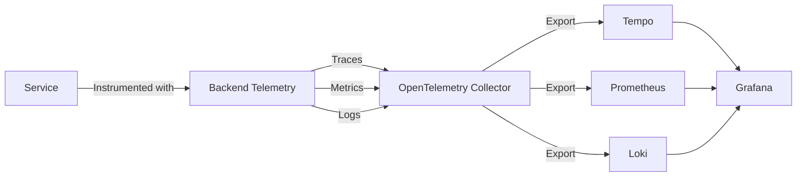

# Telemetry Implementation

## Backend Telemetry

Located in `platform-features/backend-telemetry`, provides comprehensive observability for services:

### Core Features

- OpenTelemetry integration
- Automatic Node.js instrumentation
- Unified logging with Pino
- Trace context propagation
- Metric collection

### Architecture



### Usage Example

```typescript
import { initTelemetry } from '@clean-stack/platform-features/backend-telemetry';

const { telemetrySdk, mainLogger } = initTelemetry({
  serviceName: 'user-service',
  serviceVersion: '1.0.0',
  collectorUrl: 'http://localhost:4317',
});

// Use logger for consistent logging
mainLogger.info('Server starting');

// Graceful shutdown
process.on('SIGTERM', async () => {
  mainLogger.info('Shutting down');
  await telemetrySdk.shutdown();
});
```

## Frontend Telemetry

Located in `frontend-libs/frontend-telemetry`, provides browser-side observability:

### Core Features

- Web Vitals monitoring
- Browser trace collection
- User interaction tracking
- Error tracking
- Performance metrics

### Usage Example

```typescript
import { initTelemetry } from '@clean-stack/frontend-telemetry';

initTelemetry({
  serviceName: 'web-ui',
  collectorUrl: 'http://localhost:4318/v1/traces',
});
```

## Available Metrics

### Backend Metrics

- HTTP request latency
- gRPC method calls
- Cache hit/miss ratios
- Rate limiter statistics
- Custom business metrics

### Frontend Metrics

- Page load timing
- First Contentful Paint (FCP)
- Largest Contentful Paint (LCP)
- First Input Delay (FID)
- Custom user interactions

## Best Practices

1. **Early Initialization**

   - Initialize telemetry at service startup
   - Configure before other components
   - Handle shutdown gracefully

2. **Context Propagation**

   - Pass trace context in service calls
   - Maintain correlation IDs
   - Link related operations

3. **Structured Logging**

   - Use consistent log levels
   - Include relevant context
   - Follow log format standards

4. **Performance Impact**
   - Use sampling for high-traffic services
   - Configure appropriate batch sizes
   - Monitor telemetry overhead
