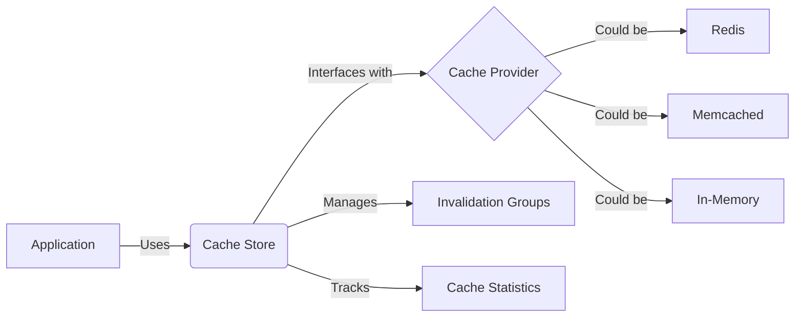

# Cache Store in Clean Stack

### What is Caching?

Caching is a technique used to store frequently accessed data in a fast-access storage layer. It helps improve application performance by reducing the need to fetch data from slower, primary data sources repeatedly.

### Why is Caching Necessary?

1. **Performance Improvement**: Caching significantly reduces data retrieval times.
2. **Reduced Load on Backend Services**: By serving data from cache, it decreases the load on databases and APIs.
3. **Improved User Experience**: Faster response times lead to better user satisfaction.
4. **Scalability**: Caching helps applications handle more concurrent users by reducing backend load.

### Cache Store Architecture

Here's a high-level overview of the cache store architecture in Clean Stack:


### Idea Behind Implementation

The Cache Store in Clean Stack is designed with the following principles:

1. **Flexibility**: The use of a `CacheProvider` interface allows for different caching backends.
2. **Grouping**: Invalidation groups enable efficient management of related cache entries.
3. **Statistics**: Built-in tracking of hits, misses, and entries for performance monitoring.
4. **Key Hashing**: Ensures consistent key storage across different cache providers.

### Why Cache Provider is a Parameter

The `CacheProvider` is passed as a parameter to `createCacheStore` for several reasons:

1. **Dependency Injection**: This design allows for easy swapping of cache implementations.
2. **Testability**: It's easier to mock the cache provider in unit tests.
3. **Flexibility**: Different parts of the application can use different caching strategies.
4. **Scalability**: As the application grows, you can switch to more robust caching solutions without changing the cache store logic.

### Using This Library to Cache a REST API

To use this cache store for caching REST API responses:

1. **Setup**:
   ```typescript
   const cacheProvider = createRedisCacheProvider(); // or any other implementation
   const cacheStore = createCacheStore(cacheProvider);
   ```

2. **Caching API Responses**:
   ```typescript
   app.get('/api/data', async (req, res) => {
     const cacheKey = `data-${req.query.id}`;
     let data = await cacheStore.get(cacheKey);
     if (!data) {
       data = await fetchDataFromDatabase();
       await cacheStore.addOrReplace(cacheKey, JSON.stringify(data), { ttl: 3600, groups: ['apiData'] });
     }
     res.json(JSON.parse(data));
   });
   ```

3. **Invalidating Cache**:
   ```typescript
   app.post('/api/data', async (req, res) => {
     // Update data in database
     await cacheStore.invalidateGroup('apiData');
     res.sendStatus(200);
   });
   ```

### Key Features of the Implementation

1. **Hashed Keys**: `computeHash` function ensures consistent key storage.
2. **Invalidation Groups**: Allows for efficient invalidation of related cache entries.
3. **Statistics Tracking**: Built-in tracking of cache performance metrics.
4. **Flexible TTL**: Optional Time-To-Live for cache entries.
5. **Async Operations**: All cache operations are asynchronous for better performance.

### Best Practices

1. Use meaningful cache keys that include relevant parameters.
2. Set appropriate TTLs to balance between data freshness and performance.
3. Use invalidation groups to manage related cache entries efficiently.
4. Monitor cache statistics to optimize cache usage and identify potential issues.

:::tip Clean Stack Cache Store
This cache store implementation provides a robust, flexible, and efficient caching solution for Clean Stack, allowing for improved performance and scalability in your applications.
:::

:::info
**Quick Trick**: Use cache store to cache frequently accessed data and reduce load on backend services.

**Use Request Body as Key**: When caching API responses, consider using the request body as part of the cache key to ensure unique caching for different requests.
:::

