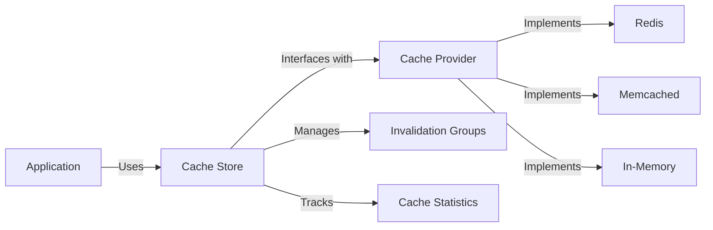

# Cache Store for Clean Stack

## What is Caching?

Caching is a technique used to store copies of frequently accessed data in a high-speed storage layer, allowing faster retrieval in subsequent requests. It significantly improves application performance by reducing the need to fetch data from slower storage systems or compute expensive operations repeatedly.

## Why is Caching Necessary?

1. **Performance Improvement**: Caching reduces response times and increases throughput.
2. **Resource Optimization**: It reduces load on backend systems and databases.
3. **Scalability**: Caching helps applications handle more concurrent users.
4. **Cost Reduction**: By reducing computational and network load, caching can lower infrastructure costs.

## Cache Store Architecture



## Implementation Idea

The Cache Store in Clean Stack is designed with flexibility and efficiency in mind:

1. **Abstraction**: The core `CacheStore` interface abstracts the caching logic, allowing different cache providers to be used interchangeably.
2. **Provider-Agnostic**: By accepting a `CacheProvider` as a parameter, the implementation supports various caching solutions (Redis, Memcached, in-memory, etc.) without changing the core logic.
3. **Invalidation Groups**: The store implements a group-based invalidation mechanism, allowing efficient invalidation of related cache entries.
4. **Statistics Tracking**: Built-in statistics help monitor cache performance and usage.

## Cache Provider as a Parameter

The `CacheProvider` is passed as a parameter to the `createCacheStore` function, offering several advantages:

1. **Flexibility**: Users can choose the most suitable caching solution for their needs (Redis, Memcached, in-memory, etc.).
2. **Testability**: It's easier to mock the cache provider in unit tests.
3. **Dependency Injection**: This design follows the dependency injection principle, improving modularity and maintainability.


## Significance of Invalidation Groups

:::info
Invalidation groups are a powerful feature of this cache implementation:
:::

1. **Efficient Bulk Invalidation**: Related cache entries can be invalidated together, useful for complex data relationships.
2. **Fine-grained Control**: Allows selective invalidation without clearing the entire cache.
3. **Consistency Management**: Helps maintain data consistency across related cache entries.

Usage example:

```typescript
await cacheStore.addOrReplace('user:1', userData, { groups: ['users', 'active-users'] });
// Later, invalidate all user-related caches:
await cacheStore.invalidateGroup('users');
```

## Using the Cache Store with a REST API

To use this cache store with a REST API and Redis provider:

1. Create a Redis provider:

    ```typescript
    import { RedisClientType } from 'redis';
    import { CacheProvider } from '../cache';

    export function gerRedisCacheProvider(client: RedisClientType): CacheProvider {
      return {
        set: async (key: string, value: string, ttl?: number) => {
          await client.set(key, value, { EX: ttl });
        },
        get: async (key: string) => {
          return await client.get(key);
        },

        delete: async (key: string) => {
          await client.del(key);
        },
        deleteManyKeys: async (keys: string[]) => {
          await client.del(keys);
        },
        clear: async () => {
          await client.flushAll();
        },
        getAllKeys: async () => {
          return await client.keys('*');
        },
      };
    }
    ```

2. Set up the Redis client and cache provider:

    ```typescript
    import { createClient } from 'redis';
    import { getRedisCacheProvider } from './redisCacheProvider';
    import { createCacheStore } from './cacheStore';

    const redisClient = createClient({ url: 'redis://localhost:6379' });
    await redisClient.connect();

    const redisCacheProvider = getRedisCacheProvider(redisClient);
    const cacheStore = createCacheStore(redisCacheProvider);
    ```

3. Use in API routes:

    ```typescript
    app.get('/users/:id', async (req, res) => {
      const userId = req.params.id;
      const cacheKey = `user:${userId}`;

      // Try to get from cache
      let userData = await cacheStore.get(cacheKey);

      if (!userData) {
        // If not in cache, fetch from database
        userData = await fetchUserFromDatabase(userId);
        // Cache the result
        await cacheStore.addOrReplace(cacheKey, JSON.stringify(userData), { ttl: 3600, groups: ['users'] });
      } else {
        userData = JSON.parse(userData);
      }

      res.json(userData);
    });
    ```

4. Invalidation example with group key `users`:

      ```typescript
      app.post('/users', async (req, res) => {
        // Create user in database
        const newUser = await createUserInDatabase(req.body);

        // Invalidate user-related caches
        await cacheStore.invalidateGroup('users');

        res.json(newUser);
      });
      ```


This implementation provides a flexible, efficient, and powerful caching solution for Clean Stack, enhancing performance and scalability while maintaining ease of use and adaptability to different caching backends.
